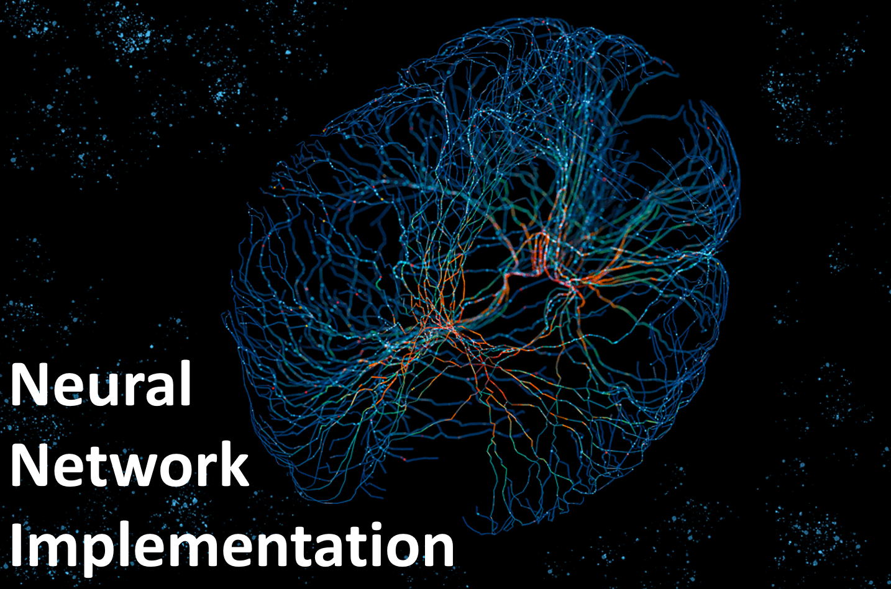

# Neural Network Implementation from Scratch

---
This project implements a simple 3-layer neural network for binary classification tasks. The network architecture consists of an input layer, one hidden layer, and an output layer. The activation function used in the hidden layer is the hyperbolic tangent (tanh) function, and the output layer uses the softmax activation for multiclass classification.

## Project Goals

1. **Build a 3-dimensional hidden layer model:** The project starts by building a neural network with a 3-dimensional hidden layer and visualizing the decision boundary.

2. **Vary Hidden Layer Size:** The impact of varying the hidden layer size (1, 2, 3, 4, 5, 20, 40) on the model's performance is investigated. Decision boundaries for each hidden layer size are plotted.

3. **Mini-batch Gradient Descent:** The project switches from batch gradient descent to mini-batch gradient descent, a more practical optimization technique.

4. **Implement Learning Rate Annealing:** Instead of using a fixed learning rate for gradient descent, an annealing schedule for the learning rate is implemented.

5. **Experiment with Activation Functions:** The project explores different activation functions for the hidden layers and adjusts the backpropagation accordingly.

6. **Extend to Three Classes:** The network is extended to handle three classes, requiring the creation of an appropriate dataset.

7. **Add a Fourth Layer:** An additional hidden layer is added to the network, and experiments are conducted by varying the layer size.
